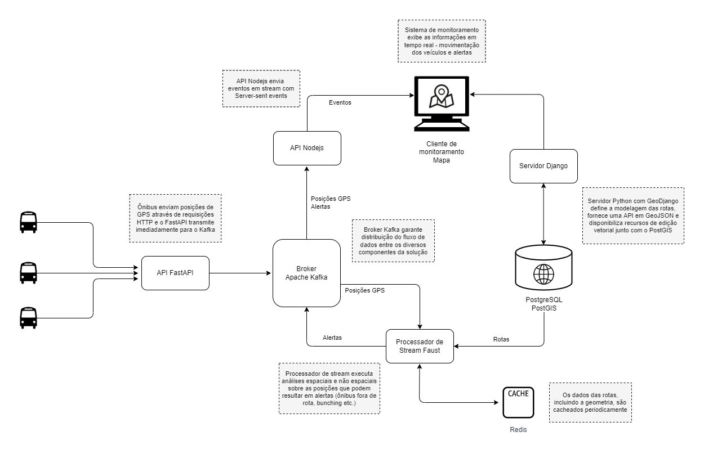
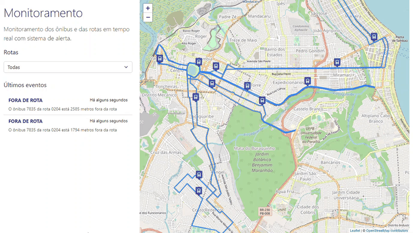
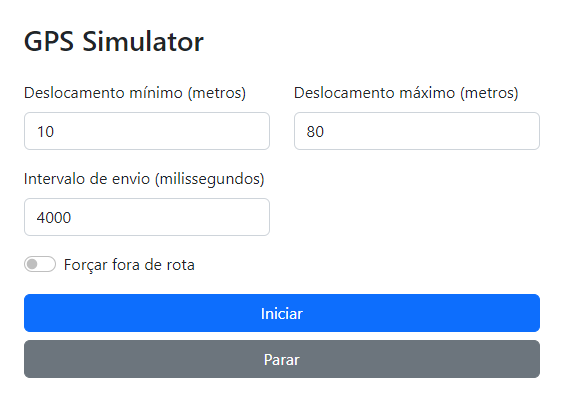

# Bus on map

Python, Javascript e Kafka para geolocalização de veículos em tempo real usando stream de dados e [Server-sent events](https://developer.mozilla.org/en-US/docs/Web/API/Server-sent_events) (SSE).

## Tecnologias

- Python: FastAPI, Faust, Django, Shapely
- Javascript: Express (Nodejs), Vanilla JS, Turf.js
- Apache Kafka
- Redis
- PostgreSQL com PostGIS
- Bootstrap

## Solução

### Demonstração

### Receiver

Uma API escrita em Python usando [FastAPI](https://fastapi.tiangolo.com/) recebe as posições dos veículos e transmite imediatamente para o Apache Kafka. A opção aqui pelo FastAPI é pela excelente performance, pois em tese um serviço com esse propósito precisa lidar com milhares de requisições por segundo (a depender do tamanho da cidade e do sistema de transportes, potencialmente centenas de veículos transmitindo posições via GPS a cada poucos segundos), e a documentação fornecida automaticamente.

### Worker

Um serviço para processamento de stream de dados também escrito em Python usando [Faust](https://github.com/robinhood/faust), que recebe todas as posições através do Kafka e executa funções responsáveis por: verificar se o ônibus está fora de rota (já implementado), detectar comboios (bunching), verificar se algum veículo está sem transmitir e outros cálculos necessários, espaciais ou não, que possam ser interessantes para o sistema de monitoramento. Quando for o caso, as funções geram alertas que são transmitidas através do Kafka. 

Aqui estou utilizando [shapely](https://shapely.readthedocs.io/en/stable/manual.html), uma biblioteca Python que me ajuda com os cálculos geométricos, como verificar se um ponto (posição dada pelo GPS) está há menos de uma data distância de uma linha (rota de ônibus), ou se dois pontos (veículos de uma mesma rota) estão muito próximos um do outro (possível comboio) etc. 

Com o [PyProj](https://pyproj4.github.io/pyproj/stable/), consigo manter ambas as geometrias no mesmo sistema de coordenadas, projetando os pontos para coordenadas métricas - uma vez que são originados no fluxo em coordenadas geográficas expressas em graus decimais no datum WGS84.

### Reports

Uma API escrita em JavaScript/Nodejs usando [Express](https://expressjs.com/) que recebe tanto as posições vindas do FastAPI quanto os alertas vindos do Faust e transmite para o cliente usando Server-sent events, que deixa as requisições em stream e o cliente pronto para receber novos “eventos” - novas posições, alertas -, sem precisar usar abordagens como Long Polling ou outro protocolo como o websocket. É uma excelente opção quando se precisa apenas de eventos enviados pelo servidor. 

A opção pelo Nodejs é pela facilidade de implementar SSE, com seu loop assíncrono gerenciando as conexões de vários clientes enquanto é apenas um único consumidor para o Kafka, sendo ótimo para construir aplicações que precisam ser “real time”; e porque me inspirei nesse [excelente material](https://www.digitalocean.com/community/tutorials/nodejs-server-sent-events-build-realtime-app) da Digital Ocean.

### Manager

Um sistema monolito escrito em Python usando [Django](https://www.djangoproject.com/) e o [GeoDjango](https://docs.djangoproject.com/en/4.0/ref/contrib/gis/) para fornecer recursos como criação e edição vetorial das rotas e qualquer outro dado geográfico necessário para o gerenciamento do sistema de transporte. Também é utilizado para fornecer uma API que retorna as rotas no formado GeoJSON para o mapa. No frontend é utilizado o bom Vanilla JS para se conectar à API de eventos do servidor Nodejs e receber as posições dos veículos e os alertas para exibição em mapa em tempo real (JS na web tem suporte nativo a SSE com a interface [EventSource](https://developer.mozilla.org/en-US/docs/Web/API/EventSource), suportada por praticamente todos os navegadores). Cada nova posição resulta na movimentação do ícone dos ônibus no mapa e cada novo alerta gera uma mensagem de alerta usando toasts do Bootstrap 5. A interface de mapa é feita com [Leaflet](https://leafletjs.com/).

### Banco de dados

Um banco de dados [PostgreSQL](https://www.postgresql.org/) com [PostGIS](https://postgis.net/) para armazenar as rotas e qualquer outro dado geográfico. Junto com o GeoDjango eu considero o casamento perfeito para construir aplicações GIS para web.

### Cache

Ainda, o [Redis](https://redis.io/) é utilizado para manter o cache das rotas, evitando que a cada nova execução de alguma análise espacial pelo Faust seja necessário bater no banco de dados para recuperá-las. As rotas ficam salvas em cache e só expiram após um dado tempo definido por variável de ambiente - afinal, rota de ônibus não é algo que muda de uma hora pra outra -, poupando o banco de dados e tempo de processamento.

Como todo o processo é distribuído em vários serviços, o sistema que recebe as posições cria uma chave de correlação que será usada em todos os sistemas, em posições e alertas, nos payloads e nos logs, para garantir a rastreabilidade.

## Simulador de GPS

Para testar tudo isso construí um simulador de GPS, onde basicamente configuro alguns parâmetros para disparar envios de coordenadas fictícias calculadas com base nas rotas originais e com a biblioteca [Turf.js](https://turfjs.org/), em que consigo fazer cálculos espaciais direto no navegador, como deslocar um ponto numa linha em X metros.

## Testes

Para os testes utilizei o framework de testes unitários nativo do Python (UnitTest) e, no caso do FastAPI, também o cliente de teste fornecido pelo framework. No servidor Nodejs, utilizei o Jest.